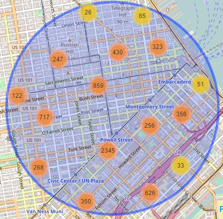
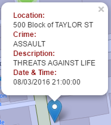
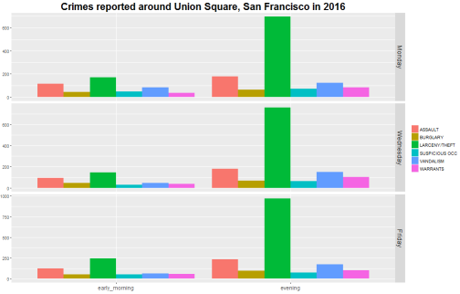
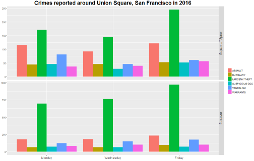
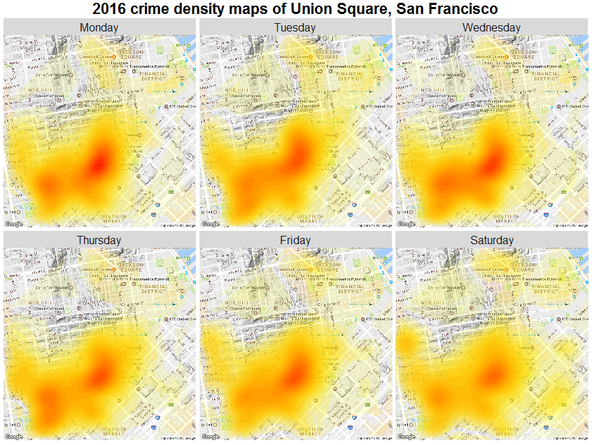

###URL
https://carlosgg.shinyapps.io/sf-crime-map/

### Motivation

I wanted an equivalent of [this Hillsborough County website](http://gis.hcso.tampa.fl.us/PublicGIS/CrimeMapping/), i.e., 
I wanted to be able to enter a Chicago address or landmark and get a plot of criminal activity within a given radius of that address/landmark.

### Technologies

[R](https://leanpub.com/rprogramming), [R Studio](https://www.rstudio.com/), [Shiny R server](http://shiny.rstudio.com/articles/), [Leaflet for R](http://rstudio.github.io/leaflet/), [ggmap](https://journal.r-project.org/archive/2013-1/kahle-wickham.pdf).

###Data source

The crime data was obtained from [SF Open Data](https://data.sfgov.org/Public-Safety/Map-Crime-Incidents-from-1-Jan-2003/gxxq-x39z/data)

### Basic usage

Either type a location's address or click on the map to obtain results in a radius around that location.
You can further filter the data by crime category, day of week, or period of the day.
You can also [facet](http://www.cookbook-r.com/Graphs/Facets_(ggplot2)/) the plots by category, day, or period.

### Map tab

The map tab displays all the reported crimes according to the options selected on the left panel.


<br><br>

The app takes the location entered and gets its longitude-latitude coordinate pair from google using ggmap's geocode() function. 
Then, using a subset() filter, the app finds the crimes reported within the given radius (0.5 mi., 1.0 mi., etc.) of the location.
The distance is computed using the [equirectangular approximation](http://www.movable-type.co.uk/scripts/latlong.html) to the distance between 2 points in a sphere, for every point in that year's database and the location entered. This approximation should be fine for intra-city distances and is much more computationally efficient than the Haversine formula. If the location entered is a map-click, then there's no need for the geocode step since the click returns the coordinates.

```
dist_equi <- function (long1, lat1, long2, lat2) {
        
        R = 6371000 # radius of the Earth
        
        # Convert latitudes to radians
        theta1 = lat1 * pi / 180.0
        theta2 = lat2 * pi / 180.0
        
        # Compute difference between two points and convert to radians
        # delta_theta = (lat2 - lat1) * pi / 180.0 
        delta_theta = theta2 - theta1
        delta_lambda = (long2 - long1) * pi / 180.0
        
        x = delta_lambda * cos((theta1 + theta2)/2.0)
        y = delta_theta
        
        # Compute distance, convert it to miles and return it
        return(R * sqrt(x*x + y*y) / 1609.34)
    }
```

Zooming in and clicking on an individual marker will show the address, description, and date and time of the incident.


<br><br>

### Data tab

Here you can view the results 25 at a time, as well as interactively filter and search and sort them. 

### Bar plots tab

The bar plots (and the density maps) are faceted according to the input selection. In order to keep the tables readable, the top six police calls categories are used.

The following shows a result of crimes on Mondays, Wednesdays, and Fridays that took place during the early morning and evening time periods, faceted by day of the week

      
<br>
The same crime set, now faceted by time of day

  

### Density maps tab

The density maps take a few seconds to display. They are generated with [ggmap](http://journal.r-project.org/archive/2013-1/kahle-wickham.pdf) and are faceted similarly to the bar plots



### Table tab

The table depicts a 3-way contingency table. The variables (category, day of the week, and period of the day) are also arranged depending on the facets chosen on the left panel.

### References

1. SF Open Data. (2017). ***Map: Crime Incidents - from 1 Jan 2003*** [CSV]. Retrieved from https://data.sfgov.org/Public-Safety/Map-Crime-Incidents-from-1-Jan-2003/gxxq-x39z/data

2. Hillsborough County Sheriff's Office. ***Hillsborough County Crime Map***. Retrieved from http://gis.hcso.tampa.fl.us/crimemapping/

3. Chow, Jo-fai. (2014, March 11). ***Introducing 'CrimeMap'***. Retrieved from http://www.jofaichow.co.uk/2014_03_11_LondonR/#1

4. Chang, Winston. ***Cookbook for R***. Sebastopol: O'Reilly Media, 2013. Retrieved from http://www.cookbook-r.com/

5. Matloff, Norman. ***The Art of R Programming***. San Francisco: No Starch Press, 2011. PDF.

6. Adler, Joseph. ***R in a Nutshell, Second Edition***. Sebastopol: O'Reilly Media, 2012. PDF.

7. D. Kahle and H. Wickham. ***ggmap: Spatial Visualization with ggplot2***. The R Journal, 5(1), 144-161. URL http://journal.r-project.org/archive/2013-1/kahle-wickham.pdf

8. Veness, Chris. ***Calculate distance, bearing and more between Latitude/Longitude points***. Retrieved from http://www.movable-type.co.uk/scripts/latlong.html

9. Roger Peng. ***Computing for Data Analysis***, Spring 2014. Coursera.

10. Shiny Articles. Retrieved from http://shiny.rstudio.com/articles/

11. Samarasa and Jarpal. ***Fixing the order of facets in ggplot***. Retrieved from http://stackoverflow.com/questions/14262497/fixing-the-order-of-facets-in-ggplot

12. Stein, Jonas and Muspratt, Sandy. ***What does size really mean in geom_point?*** Retrieved from http://stackoverflow.com/questions/13548321/what-does-size-really-mean-in-geom-point

13. Galilean Moons and Tyler Rinker. ***Convert 12 hour character time to 24 hour*** Retrieved from http://stackoverflow.com/questions/29833538/convert-12-hour-character-time-to-24-hour

14. alittleboy and G. Grothendieck. ***extract a substring in R according to a pattern*** Retrieved from http://stackoverflow.com/questions/17215789/extract-a-substring-in-r-according-to-a-pattern 

15. endmemo. ***R sub Function*** Retrieved from http://www.endmemo.com/program/R/sub.php

16. Tor and Shane. ***Suppress one command's output in R*** Retrieved from http://stackoverflow.com/questions/2723034/suppress-one-commands-output-in-r

17. Alphaneo and Dirk Eddelbuettel. ***Global variables in R*** Retrieved from http://stackoverflow.com/questions/1236620/global-variables-in-r

18. Eduardo Ariño de la Rubia and Sheila Doshi. ***A Huge Debate: R vs. Python for Data Science*** [Video] Retrieved from https://blog.dominodatalab.com/video-huge-debate-r-vs-python-data-science/

19. EliteDataScience. ***R vs Python for Data Science: Summary of Modern Advances*** Retrieved from https://elitedatascience.com/r-vs-python-for-data-science

20. LostLin and Tommy. ***switch() statement usage*** Retrieved from http://stackoverflow.com/questions/7825501/switch-statement-usage

21. kay. ***Embedding Image in Shiny App*** Retrieved from http://stackoverflow.com/questions/21996887/embedding-image-in-shiny-app